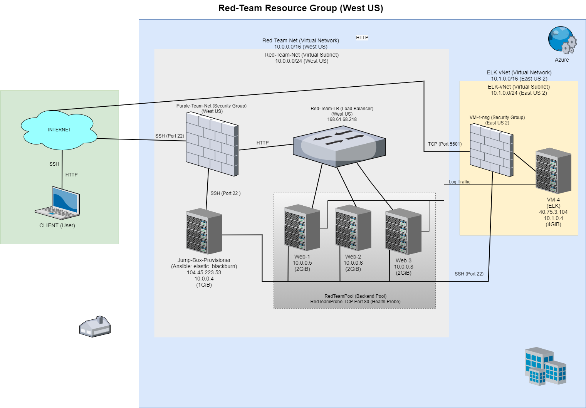
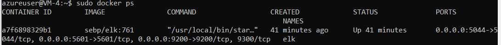
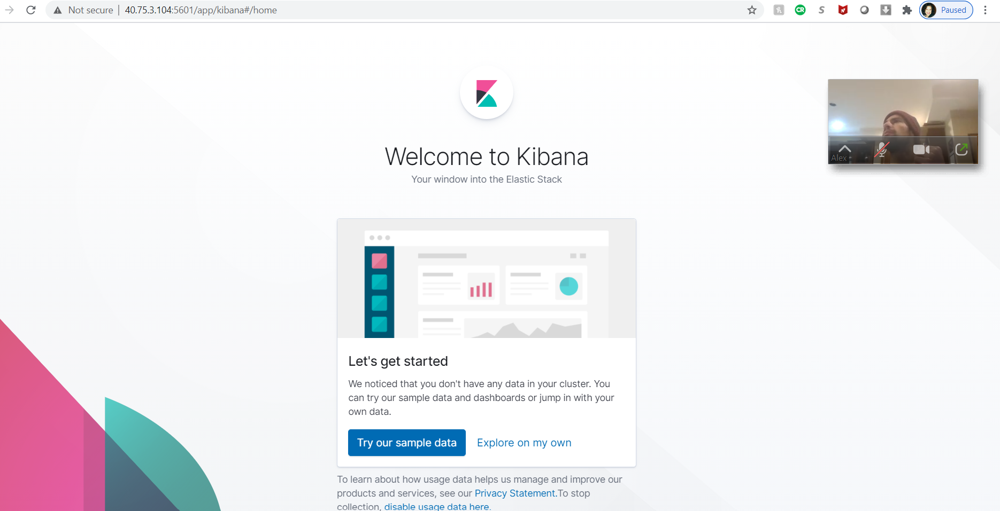
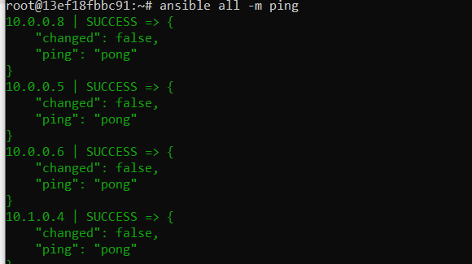

## Automated ELK Stack Deployment

The files in this repository were used to configure the network shown below.



After beeing tested, these files were used to generate a live ELK deployment on an Microsoft Azure network, through a Jumpbox provisioner with an Ansible container. These files can be used to recreate the entire deployment pictured above or to install certain pieces of it, such as Filebeat.

This document contains the following details:
- Description of the Topology
- Access Policies
- ELK Configuration
  - Beats in Use
  - Machines Being Monitored
- How to Use the Ansible Build


### Description of the Topology

The main purpose of this network is to expose a load-balanced and monitored example of D*mn Vulnerable Web Application (DVWA). A load Balancer (LB) was used to distribute web traffic across different servers, which logs can be monitored through an ELK monitoring stack within a separate virtual network (VNet).

We use a "jump box" (Jump-Box-Provisioner) as a gateway between the host machine (Client/User) and our webservers (Web-1 through -3), and the host machine and the ELK server (VM-4) which is used for monitoring the webservers. 

A jump box has its own public internet, accessed by SSH port 22, and it does not expose machines connected to it to the internet. Access control to the jump box is done only through specific IP addresses that can be set through security groups. Also, `sudo` access of the administrator account can be limited to the jump box only. Log and system monitoring can be implemented through the jump box, in addition to two-factor SSH login authentication, host firewalls, and virtual private networks to securely connect to a cloud network. Securing and monitoring a gateway, instead of each machine in the network, is much more time and financial effectively.

This system network also benefits from a load balancer (Red-Team-LB). Load balancing ensures that the application will be highly available, in addition to restricting inbond access to the network.

The load balancer provides an external IP address (accessed by the internet) to a website. After receiving traffic, the LB distributes it across multiple servers, which can be expanded as the need arises, helping distribute traffic evenly among the servers to minimize the effects of possible Denial of Service (DoS) attacks. An LB has also a "health probe" that regularly checks the web servers' functionality, before sending traffic to them - issues with a server will be reported and traffic to it will be halted. Although the system could still become overwhelmed with traffic, it is much more effective than a single server running the website.
    
Integrating an ELK server allows users to easily monitor the vulnerable VMs for changes to the file names and watch system metrics through monitors like Filebeat and Metricbeat. These monitors automate functions that tends to be too tedius and innefective, if done mannually by a system administrator. 
  * Filebeat monitors the logs in the specified location, detects changes to the filesystem, collects logs, and forwards them to Elastisearch or Logstash for indexing.
  * Metricbeat detects changes in the system, such as CPU usage and SSH login attempts.

The configuration details of each machine is as follows:


| Name                 | Function                | Internal IP | Operating System |
|----------------------|-------------------------|-------------|------------------|
| Jump-Box-Provisioner | Gateway (Ansible)       | 10.0.0.4    | Linux            |
| Web-1                | Server                  | 10.0.0.5    | Linux            |
| Web-2                | Server                  | 10.0.0.6    | Linux            |
| Web-3                | Server                  | 10.0.0.8    | Linux            |
| VM-4                 | Server (ELK Monitoring) | 10.1.0.4    | Linux            |

### Access Policies

The machines on the internal network are not exposed to the public Internet. 

Only the Jump-Box-Provisioner gateway machine can accept connections from the Internet. Access to this machine is only allowed from the pre-designated public IP address (CLIENT/User) on a SSH connection (using key pair) through port 22.

Machines within the network can only be accessed by peer servers. Only the Jump-Box-Provisioner (IP 104.45.223.53) can connect through SSH to the website servers (Web-1, Web-2, Web-3) and the Elk server (VM-4). 

All accesses are configured through separate Security Groups (Purple-Team-Net for Jump-Box, Load Balancer, Web servers; and VM-4-nsg for the Elk server VM-4)

A summary of the access policies in place can be found in the table below.

| Name                 | Function                | Public  Access? | IP Address Allowed |
|----------------------|-------------------------|-----------------|--------------------|
| Jump-Box-Provisioner | Gateway (Ansible)       | YES             | Pre-designated     |
| Web-1                | Server                  | NO              | 10.0.0.4           |
| Web-2                | Server                  | NO              | 10.0.0.4           |
| Web-3                | Server                  | NO              | 10.0.0.4           |
| VM-4                 | Server (ELK Monitoring) | NO              | 10.0.0.4           |

### Elk Configuration

A Docker-managed container running Ansible was used to automate configuration of the ELK machine (VM-4). No configuration was performed manually, which is advantageous because using Ansible allowed installation, updates, and additions of programs to the network, using "playbooks" created once instead of manually doing those tasks for each machine. Another advantage is that if one container run into problems or attacks, the system administrator can kill and regenerate it as needed, without downtime for the active servers. Containers also reduce operational costs by eliminating a large amount of file and CPU overhead. 

The playbook implements the following tasks:
  * Installing Docker on all network machines to receive and install containers
  * Installing Ansible on the Jump-Box-Provisioner to distribute containers to other machines in the network
  * Using Ansible playbooks to configure and install ELK stack container on the VM-4 (ELK Server) and "beats" containers on the webservers (Web-1 through -3).

After creating a new virtual network (ELK-vNet) within the same resource group (Red-Team) but located on a separate region (East US 2), we created a peer-connection between both the existing virtual network (Red-Team-net) and the ELK-vNet. We then created a new virtual machine (VM-4), using the SSH key from the Ansible container (elastic_blackburn) to run ELK monitoring. 

We added the internal IP of our new VM-4 to the Ansible "hosts" file in our container "elastic_blackburn" located in the Jump-Box-Provisioner:
```
   [webservers]
    10.0.0.5
    10.0.0.6
    10.0.0.8
   [elkservers]
    10.1.0.4 
```
We then created a playbook to use with the new VM-4 (ELK) machine, specifying a different group of machines and the remote use:
```
- name: Config elk server VM-4 with Docker
  hosts: elk
  remote_user: azureuser
  become: true
  tasks: 
  ```
We increased its memory, a requirement for an Elk container: 
```
- name: Increase memory
  sysctl:
  name: vm.max_map_count
  value: '262144'
```
The playbook will then install `docker.io`, `python3-pip`, and `docker`:

Here is the complete playbook [Docker Configuration file](Ansible/Config-VM-w-Docker)

After installation of Docker we downloaded and run the `sebp/elk:761` container, which had the following published ports:
  * `5601:5601`
  * `9200:9200`
  * `5044:5044`

We verified the connectivity between the Ansible container (elastic_blackburn) to the new VM-4 machine. We could then verify that the new `elk-docker` was running, using `sudo docker ps`, with the following result:



A security rule was then created on port `5601` to allow TCP traffic from the Client/User IP address into the new VM-4 Elk server. We verified that the playbook worked by visiting `http://[VM-4.IP]:5601/app/kibana`, using the public address of the new VM-4 machine, which resulted in:



### Target Machines & Beats
The VM-4 (ELK server) is configured to monitor the following machines:
| Name  | IP Address |
|-------|------------|
| Web-1 | 10.0.0.5   |
| Web-2 | 10.0.0.6   |
| Web-3 | 10.0.0.8   |

We installed Filebeat and Metricbeat to monitor the  the webserver machines:
 
  * Filebeat is designed to ship log files. It helps keep things simple by offering a lightweight way (low memory footprint) to forward and centralize logs and files, making the use of SSH unnecessary when you have a number of servers, virtual machines, and containers that generate logs. Other benefits of Filebeat are the ability to handle large bulks of data, the support of encryption, and deal efficiently with backpressure. In this case, Filebeat is a logging agent installed on VM-4 (ELK server) to monitor activities in three servers (Web-1 through -3), monitoring its logs, tailing them, and forwarding the data to VM-4 (ELK server) that can be accessed through the monitoring page, Kibana dashboard (specified in the Filebeat configuration file). It tracks system logs, sudo commands, SSH logins, new users and groups, etc.

  * Metricbeat is a lightweight shipper installed on our servers to periodically collect metrics from the operating system and from services running on the servers (Web-1 through -3). It detects changes in system metrics, like CPU usage and memory, loads, inbound and outbound traffic, cache, API segment requests, average response, requests rates, etc.

### Configuring Files and Using Playbooks for Monitoring Services
In order to use the playbooks and install Filebeat and Metricbeat monitoring services, you will need to have an Ansible control node already configured, as explained above. Assuming you have such a control node provisioned, SSH into the control node and follow the steps below.

1. Start the servers in Azzure.Verify that they are running using the `ping` command from the Jump-Box-Provisioner:
   
2. Open the terminal and access jump-box. In this case, we SSH to our Jump-Box-Provisioner.
3. Start and attach the Ansible container. In this case, we run `sudo docker start elastic_blackburn && sudo docker attach elastic_blackburn`
4. Copy [Filebeat configuration file](Monitoring/Filebeat/Config-Filebeat) into the Ansible Container: (we created a "files" subfolder) /etc/ansible/files. 
5. Open the Config-Filebeat with nano and change the IP address (line 1106) with the VM-4 Elk machine:
   ```
   output.elasticsearch:
   hosts: [10.1.0.4:9200]
   username: "elastic"
   password: "changeme"
   ```
   -> Do not change the username or password 
6. Also change line 1806 with the VM-4 Elk machine IP:
```
setup.kibana:
host: 10.1.0.4:5601
```
7. Copy the [Filebeat Playbook](Monitoring/Filebeat/Filebeat-Playbook.yml) file to /etc/ansible/roles directory. Note that in this case, we had a "roles" subfolder to hold playbooks.
8. Update the "hosts" file to include the internal/private IP addresses of servers. This will make Ansible run the playbook on the specified machines. In this case, we assigned each server to their server groups as follows:
```
   [webservers]
    10.0.0.5
    10.0.0.6
    10.0.0.8
   [elkservers]
    10.1.0.4 
```
    
9. Run the playbook, and navigate to `http://[VM-4.IP]:5601/app/kibana` to check that the installation worked as expected. In this case, the public IP address of our VM-4 ELK server:
   Click on "Add Log Data": 
![ ][Images/Kibana-Filebeat.png]

   Click on "Systems Log":
![ ][Images/Kibana-Filebeat1.png]

   Scroll down and click on "Check Data" to pull data from the servers, then click on "System Logs Dashboard" to visualize the logs:
![ ][Images/Kibana-Filebeat2.png]
 
Continue on to install Metricbeat, changing a few of the steps as follows:

4.Copy [Metricbeat configuration file](Monitoring/Metricbeat/Config-Metricbeat) into the Ansible Container: (we created a "files" subfolder) /etc/ansible/files. Skip step 5 - you already made that change prior to installing Filebeat.
5. Open the Config-Metricbeat with nano and change the IP address (line 1106) with the VM-4 Elk machine:
   ```
   output.elasticsearch:
   hosts: [10.1.0.4:9200]
   username: "elastic"
   password: "changeme"
   ```
   -> Do not change the username or password 
6. Also change line 1806 with the VM-4 Elk machine IP:
```
setup.kibana:
host: 10.1.0.4:5601
```
7. Copy the [Metric Playbook](Monitoring/Metricbeat/Metricbeat-Playbook.yml) file to /etc/ansible/roles directory.
8. Skip - it was done for Filebeat.
9. Run the Playbook and navigate to `http://[VM-4.IP]:5601/app/kibana` using the public IP address of the Elk Server (in our case, VM-4 public IP).
   Click on "Add Metric Data": 
![ ][Images/Kibana-Metricbeat.png]

   Click on "Docker Metrics":
![ ][Images/Kibana-Metricbeat1.png]

   Scroll down and click on "Check Data" to pull data from the servers, then click on "Docker Metrics Dashboard" to visualize information about the Elk machine:
![ ][Images/Kibana-Metricbeat2.png]

